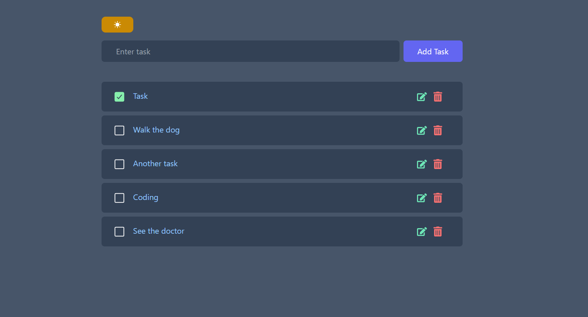

# React Task Tracker
React Task Tracker is a simple useful tool built with react to keep track of your tasks and to-dos for the day. you can add tasks , edit and delete them. you can also click on any specific task to open the detailed view. 

Check out  [live demo](https://rezabr1999.github.io/react-task-tracker/)
Screenshot of the app :

## Features

- **JSX:** Used to write HTML within JavaScript, making the UI code easy to understand.
- **Components:** The app is divided into reusable components.
- **Props & Prop Passing:** Data is passed between components using props, allowing for dynamic and flexible UI.
- **useState:** Manages the state of tasks and other UI elements.
- **useReducer:** Offers better control for handling actions in state management.
- **Context API:** Passes down state and functions to deeply nested components without prop drilling.
- **Local Storage:** Persists task data using the browser's local storage, ensuring tasks remain after a page refresh.
